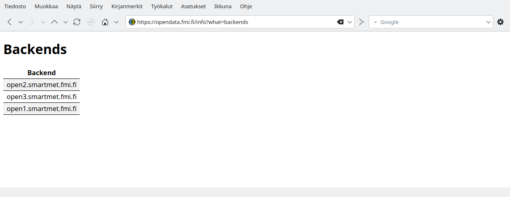
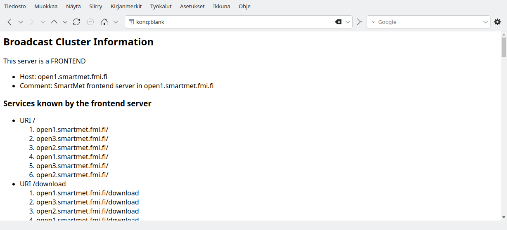
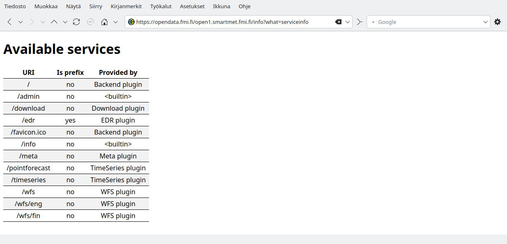
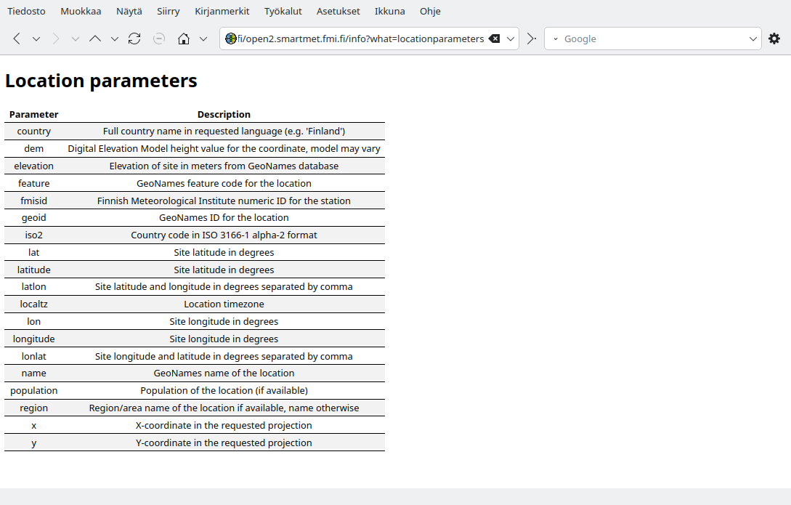
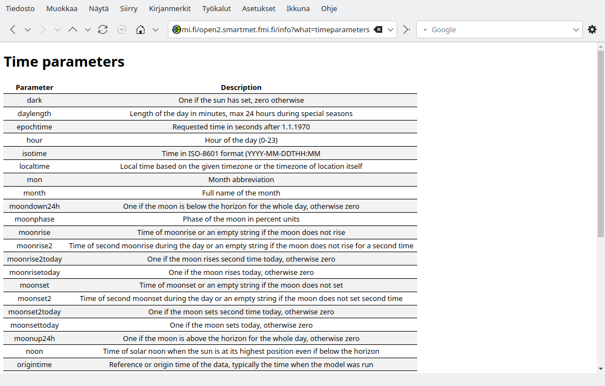

Table of Contents
=================

  * [SmartMet Server](#SmartMet Server)
  * [Introduction](#introduction)
    * [List of requests](#list-of-requests)
    * [Cluster information](#cluster-information)
    * [Service information](#service-information)
    * [Services](#services)
    * [Backends](#backends)
    * [QEngine](#qengine)
    * [GeoEngine reload](#geoengine-reload)
    * [Service statistics](#service-statistics)
    * [Cache statistics](#cachestats)
    * [Active requests](#active-requests)
    * [Querydata producers](#querydata-producers)
    * [GRID producers](#grid-producers)
    * [GRID generations](#grid-generations)
    * [GRID querydata generations](#grid-querydata-generations)
    * [Observation producers](#observation-producers)
    * [Parameters](#parameters)
    * [GRID parameters](#grid-parameters)
    * [Observation parameters](#observation-parameters)
    * [Location parameters](#location-parameters)
    * [Time parameters](#time-parameters)
    * [Stations](#stations)
    * [Logging](#logging)
    * [Last requests](#last-requests)
    * [Pausing](#pausing)
    * [Reloading station information](#reloading-station-information)

# SmartMet Server

[SmartMet Server](https://github.com/fmidev/smartmet-server) is a data and product server for MetOcean data. It
provides a high capacity and high availability data and product server
for MetOcean data. The server is written in C++, since 2008 it has
been in operational use by the Finnish Meteorological Institute FMI.

# Introduction

SmartMet server provides status and administration services. It can provide the cluster information regarding the frontend and backend servers.

All status and administration services are available through URI **/admin** (for example https://opendata.fmi.fi/admin?what=*task*, possibly with additional parameters)
Part of these services are public and are available also through URI **/info** (for example https://opendata.fmi.fi/info?what=*task*)

Frontend server can also forward **/info** request to the specified backend server. Similar **/admin** request forwarding is not supported. Additionally access to /admin requests may be restricted by IP address filter. URI **/info** is used below in examples for public requests. They all are available also through /admin

One can get list of backend servers by one of frontend server **/info** or **/admin** request backends. For example
    https://opendata.fmi.fi/info?what=backends

Entry from the response can be used to query specified backend server.

An example (get list of info requests provided by one of backend servers):
    https://opendata.fmi.fi/open1.smartmet.fmi.fi/info?what=list

Generic format of backend info request access through frontend is
    https://<fronetend_server>/<backend_server>/info?what=*task*

Replace here and below **<frontend_server>** with the name of the frontend server (for example **opendata.fmi.fi**) and **<backend_server>** with name of backend server

Frontend does not receive information about backend server admin requests and result one must send them directly to required backend

Many of the responses are returned in table form by default. The documentation includes some images of the responses visualized by the [SmartMet Server Metadata Catalog](https://github.com/fmidev/smartmetserver-metadata-catalog) available from GitHub (reconfiguring the list of known servers is easily done).

Access to these requests requires related configuration settings in SmartMet Server configuration (section <b>admin</b>). Example
of this section:
<pre>
admin:
{
    uri = "/admin";
    user = "user_name";
    password = "password";
};
</pre>

Currently URI for info requests is hardcoded (**/info**)

Part of admin requests requires user name and password and are not available if user name and/or password are not provided in configuration.

Below is a sample screenshot of the WWW-interface:

## List of requests

One can get list of available requests using request **list**
* List of all info requests available from frontend `opendata.fmi.fi`: https://opendata.fmi.fi/info?what=list.
  Note that response only includes that does not have restricted access
* List of all admin requests available from frontend `opendata.fmi.fi`: http://smartmet.fmi.fi/admin?what=list.
  Note that response includes all requests. Access to this service may be
  restricted in the future
* List of all info requests available from one of the backends of `opendata.fmi.fi`:
  https://opendata.fmi.fi/open1.smartmet.fmi.fi/info?what=list
  One can use **/info** request **backends** to get list ov available backends.
* Viewing admin requests of backend through frontend server is not supported

## Backends

In the SmartMet server environment,  the frontends know what services the backends provide. One can request for either the full list of backends or just those that provide a  given service. The output includes the names of the backends plus the IP address including the port. The output format can be selected.

The request to get the information regarding all backend servers:

http://opendata.fmi.fi/info?what=backends&format=debug

The result of this request can be in the following format (in case of use of **/admin** additionally IP addresses and ports are also returned,
for **/info** only backend server names):

The backends with autocomplete service:

http://opendata.fmi.fi/info?what=backends&service=autocomplete&format=debug

## Cluster information

The cluster status information can be requested both from the frontends and the backends. However, one cannot choose the frontend, since the selection is done by the load balancer.

The request to get the broadcast cluster status information at the frontend:

https://opendata.fmi.fi/info?what=clusterinfo

In case of accessing cluster information through **/admin** more information is returned

The result of this request consists of the server information and the services known by the frontend

The request to get the backend status information for backend server BServer:

    https://FServer/BServer/info?what=clusterinfo

An example

    https://opendata.fmi.fi/open1.smartmet.fmi.fi/info?what=clusterinfo

## Service information

The service status information can be requested the backends.

The request to get the backend status information for backend server:

 https://opendata.fmi.fi/open1.smartmet.fmi.fi/info?what=serviceinfo

The result of this request consists of the services currently provided by this server

## Service stats

SmartMet server optionally logs statistics for successfully handled requests. Access to this functionality is available through the query in which one has to specify the name of the server:

Request is admin?what=servicestats
Backend service stats are not available through frontend

This functionality is disabled by default, to enable it run the following query:

    http://<server>/admin?what=servicestats&logging=enable

Requests **servicestats** is not available through **/info**

Similarly, statistics collection can be disabled by replacing "enable" with "disable". Currently, requests older than one week are not considered.

## QEngine

QEngine maintains the QueryData in memory. The admin-queries can be used to obtain the information about the currently loaded QueryData.
For backends the current list of loaded files in server Server1 can be obtained as follows (replace ):

    https://<frontend_server>/<backend_server>/info?what=qengine

Real example:

    https://opendata.fmi.fi/open2.smartmet.fmi.fi/info?what=qengine

Projection output defaults to newbase form. If WKT form is needed, supply additional &projformat=wkt.

Usually one is interested in what data is currently loaded in ALL backends which are visible to the given frontend. For this, a similar query can be performed to a frontend-server:

    https://opendata.fmi.fi/info?what=qengine

This output shows the files which are currently available in all backends providing the timeseries - service. One can refine the search to include only files (producers) which provide given parameters:

    https://opendata.fmi.fi/info?what=qengine&param=Pressure,Icing

Newbase id numbers are also supported, the search above is identical to:

    https://opendata.fmi.fi/info?what=qengine&type=id&param=480,1

Keep in mind  that the actual responding backend and frontend given by opendata.fmi.fi is unpredictable. This is not an issue as long as all frontends serve the same backends.

Below is a screenshot of a response in the Metadata Catalog:

## GeoEngine reload

GeoEngine can reload the geonames database in a separate thread, and quickly swap all the information into use, replacing all the previously downloaded data. The swap will be delayed by active read requests until the write operation gains a lock on the necessary data structures.

Note that the reload request will  use one thread from the server until the swap has been completed. If you are running a debug server with only one thread, you will not be able to do any requests while the reload is in progress.

    http://<backend_server>/admin?what=reload

Possible responses from the server are:

    1. GeoEngine reload refused, one is already in progress
    2. GeoEngine reloaded in N seconds

It is also possible than an error occurs during the reload, for example if the MySQL server has gone down. In that case the old data structures remain active and no data is lost.

## Service statistics

The server keeps statistics on server requests which can be queried with

    http://<backend_server>/admin?what=servicestats

* The querystring option `plugin` can be used to limit the response to a single plugin.
* The querystring option `format` can be used to change the output format from the default `debug`.

Below is a sample response as visualized by the Metadata Catalog:

## Cache statistics

Each engine and plugin used by the server may keep internal caches whose sizes may require tuning for best performance. The statistics can be queried with

    http://<backend_server>/admin?what=cachestats

* The querystring option `format` can be used to change the output format from the default `html`
* The querystring option `timeformat` can be used to change the time formatting from the  default `sql`

Below is a sample response as visualized by the Metadata Catalog:

## Active requests

The server keeps track of active requests which have not been completed yet. This is occasionally useful for tracking down large requests which are hogging server resources. The active requests can be queried with

    http://<backend_server>/admin?what=activerequests

* The querystring option `format` can be used to change the output format from the default `json`

Below is a sample response as visualized by the Metadata Catalog:

## Querydata producers

The querydata producers configured to the server can be listed with

    https://<frontend_server>/<backend_server>/info?what=producers

An example:
    https://opendata.fmi.fi/open3.smartmet.fmi.fi/info?what=producers

* The querystring option `format` can be used to change the output format from the default `debug`
* The querystring option `producer` can be used to limit the output to a single producer name
* The querystring option `timeformat` can be used to change the time formatting from the default `sql`

Below is a sample response as visualized by the Metadata Catalog. The screen capture does not show all the columns, which show all the configuration parameters for the listed producer.

## GRID producers

The available grid data producers can be listed with

    https://<frontend_server>/<backend_server>/info?what=gridproducers

* The querystring option `format` can be used to change the output format from the default `debug`
* The querystring option `producer` can be used to limit the output to a single producer name
* The querystring option `timeformat` can be used to change the time formatting from the default `sql`

This information is only available when SmartMet server uses grid engine (smartmet-engine-grid). It is not
currently used for https://opendata.fmi.fi

Below is a sample response as visualized by the Metadata Catalog:

## GRID generations

Different model runs which may consist of multiple grid data files are called generations. The data for a particular generation can usually be requested by specifying the `origintime` querystring option. The information can be requested with

    https://<frontend_server>/<backend_server>/info?what=gridgenerations

* The querystring option `format` can be used to change the output format from the default `debug`
* The querystring option `producer` can be used to limit the output to a single producer name
* The querystring option `timeformat` can be used to change the time formatting from the default `sql`

This information is only available when SmartMet server uses grid engine (smartmet-engine-grid). It is not
currently used for https://opendata.fmi.fi

Below is a sample response as visualized by the Metadata Catalog:

## GRID querydata generations

In GRID mode the server can also bypass the QueryData engine, as the Grid Engine can also process querydata files. The information on the available querydata generations can be requested with

    http://<frontend_server>/<backend_server>/info?what=gridgenerationsqd

`sqd` is the common suffix used for binary querydata files at `FMI`.

* The querystring option `format` can be used to change the output format from the default `debug`
* The querystring option `producer` can be used to limit the output to a single producer name
* The querystring option `timeformat` can be used to change the time formatting from the default `sql`

This information is only available when SmartMet server uses grid engine (smartmet-engine-grid). It is not
currently used for https://opendata.fmi.fi

Below is a sample response as visualized by the Metadata Catalog:

## Observation producers

The available observation producers can be queried with

    https://<frontend_server>/<backend_server>/info?what=obsproducers

An example:

    https://opendata.fmi.fi/open1.smartmet.fmi.fi/info?what=obsproducers

* The querystring option `format` can be used to change the output format from the default `debug`
* The querystring option `producer` can be used to limit the output to a single producer name
* The querystring option `timeformat` can be used to change the time formatting from the default `sql`

Below is a sample response as visualized by the Metadata Catalog:

## Parameters

The known querydata parameters can be queried with

    https://<frontend_server>/<backend_server>/info?what=parameters

An example:
    http://opendata.fmi.fi/open1.smartmet.fmi.fi/info?what=parameters

* The querystring option `format` can be used to change the output format from the default `debug`
* The querystring option `producer` can be used to limit the output to a single producer name
* The querystring option `timeformat` can be used to change the time formatting from the default `sql`

Below is a sample response as visualized by the Metadata Catalog. The interface has been used to search for producers which provice the `IceConcentration` parameter.

## GRID parameters

The known Grid parameters can be queried with

    https://<frontend_server>/<backend_server>/info?what=gridparameters

* The querystring option `format` can be used to change the output format from the default `debug`
* The querystring option `producer` can be used to limit the output to a single producer name
* The querystring option `timeformat` can be used to change the time formatting from the default `sql`

This information is only available when SmartMet server uses grid engine (smartmet-engine-grid). It is not
currently used for https://opendata.fmi.fi

Below is a sample response as visualized by the Metadata Catalog. The interface has been used to search for producers which provice the `Temperature` parameter.

## Observation parameters

The known observation parameters can be queried with

    https://<frontend_server>/<backend_server>/info?what=obsparameters

An example

    https://opendata.fmi.fi/open1.smartmet.fmi.fi/info?what=obsparameters

* The querystring option `format` can be used to change the output format from the default `debug`
* The querystring option `producer` can be used to limit the output to a single producer name
* The querystring option `timeformat` can be used to change the time formatting from the default `sql`

Below is a sample response as visualized by the Metadata Catalog. The interface has been used to search for producers which provice the `Temperature` parameter.

## Location paremeters

Parameters that depend on site location only can be queried with

    https://<frontend_server>/<backend_server>/info?what=locationparameters

An example

    https://opendata.fmi.fi/open1.smartmet.fmi.fi/info?what=locationparameters

Only these parameters, that can be taken directly from [SmartMet::Spine::Location](https://github.com/fmidev/smartmet-library-spine/blob/master/spine/Location.h) and
does not require additional information are included

## Time parameters

Parameters that are related to time can be queried with

    https://<frontend_server>/<backend_server>/info?what=timeparameters

An example

    https://opendata.fmi.fi/open1.smartmet.fmi.fi/info?what=timeparameters

## Stations

The known stations can be queried with

    https://<frontend_server>/<backend_server>/info?what=stations

An example

    http://opendata.fmi.fi/open1.smartmet.fmi.fi/info?what=stations

* The querystring option `format` can be used to change the output format from the default `debug`
* The querystring option `timeformat` can be used to change the time formatting from the default `sql`
* The querystring option `fmisid` can be used to limit the search based on the FMI station number
* The querystring option `lpnn` can be used to limit the search based on the legacy FMI LPNN station number
* The querystring option `wmo` can be used to limit the search based on the station WMO number
* The querystring option `rwsid` can be used to limit the search based on the Finnish road station number
* The querystring option `type` can be used to limit the search based on the type of the station
* The querystring option `name` can be used to limit the search based on the name of the station
* The querystring option `country` can be used to limit the search based on the ISO code of the country
* The querystring option `region` can be used to limit the search based on the region the station is in
* The querystring options `starttime` and `endtime` can be used to limit the search based on the time the station has been active
* The querystring option `bbox` of form `lon1,lat1,lon2,lat2` can be used to limit the search area

Below is a sample response as visualized by the Metadata Catalog. The interface has been used to search for highest stations in Espoo.

## Logging

Logging requests to memory can be enabled and disabled using queries

    http://<backend_server>/admin?what=setlogging?status=enable
    http://<backend_server>/admin?what=setlogging?status=disable

The current status can be queried with

    http://<backend_server>/admin?what=getlogging

* The querystring option `format` can be used to change the output format from the default `json`

The response value is either `Enabled` or `Disabled`.

## Last requests

The requests logged to memory can be queried with

    http://<backend_server>/admin?what=lastrequests

* The querystring option `format` can be used to change the output format from the default `json`
* The querystring option `minutes` can be used to modify how many minutes of last request are returned, the default value is one.
* The querystring option `plugin` can be used to limit the request to a specific plugin

## Pausing

A backend can be requested to pause serving the frontends using

    http://<backend_server>/admin?what=pause

By default the server will pause until the request

    http://<backend_server>/Server1/admin?what=continue

is used.

* If the querystring option `time` is give, the server will pause until the specified time
* If the querystring option `duration` is given, the server will pause for the given duration and then continue automatically.

## Reloading station information

The request

    http://<backend_server>/admin?what=reloadstations

can be used to request the Observation Engine to reload all station info cached into memory from the backend observation metadata database.
