Table of Contents
=================

  * [SmartMet Server](#SmartMet Server)
  * [Introduction](#introduction)
    * [Cluster information](#cluster-information)
    * [Service information](#service-information)
    * [Services](#services)
    * [Backends](#backends)
    * [QEngine](#qengine)
    * [GeoEngine reload](#geoengine-reload)
    * [Service statistics](#service-statistics)
    * [Cache statistics](#cachestats)
    * [Active requests](#active-requests)
    * [Querydata producers](#querydata-producers)
    * [GRID producers](#grid-producers)
    * [GRID generations](#grid-generations)
    * [GRID querydata generations](#grid-querydata-generations)
    * [Observation producers](#observation-producers)
    * [Parameters](#parameters)
    * [GRID parameters](#grid-parameters)
    * [Observation parameters](#observation-parameters)
    * [Stations](#stations)
    * [Logging](#logging)
    * [Last requests](#last-requests)
    * [Pausing](#pausing)
    * [Reloading station information](#reloading-station-information)
    * [Listing](#listing)

# SmartMet Server

[SmartMet Server](https://github.com/fmidev/smartmet-server) is a data and product server for MetOcean data. It
provides a high capacity and high availability data and product server
for MetOcean data. The server is written in C++, since 2008 it has
been in operational use by the Finnish Meteorological Institute FMI.

# Introduction

SmartMet server provides status and administration services. It can provide the cluster information regarding the frontend and backend servers. Admin plugin can give the information about the services that can be provided by  a particular backend server and also the names of the backend servers which provide a particular service etc.

Since the front ends delegate the requests to a random background
machine, the plugin is usually called for a dedicated machine as given
in the examples below. In the examples Server1 and Server2 are the
servers for which the information is sought. The admin plugin queries
described in this section should not be directly accessed by users.

    http://data.fmi.fi/admin?what=<task>
    http://data.fmi.fi/admin?what=<task>

Many of the responses are returned in tabular JSON form. The documentation includes some images of the responses visualized by the [SmartMet Server Metadata Catalog](https://github.com/fmidev/smartmetserver-metadata-catalog) available from GitHub (reconfiguring the list of known servers is easily done).

Access to these requests requires related configuration settings in SmartMet Server configuration (section <b>admin</b>). Example
of this section:
<pre>
admin:
{
    uri = "/admin";
    user = "user_name";
    password = "password";
};
</pre>

Part of requests requires user name and password and are not available if user name and/or password are not provided.

Frontend server does not have information about admin requests of backend servers and as result cannot forward admin requests to these
backend servers.

Below is a sample screenshot of the WWW-interface:

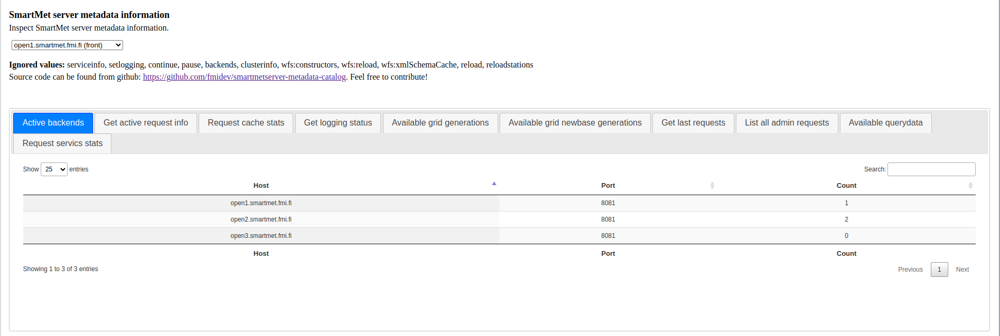

# Admin request support

SmartMet Server components that can provide administration or related information requests registers callbacks for such requests.
Some examples:

* Cluster information
* Known backends 
* Service access information
* Available querydata and GRIB data
* GeoEngine reload
* Cache statistics of engines and plugins

Only admin requests of actually used components are availabla. For example requests provided by observation engine are only available when observation engine is loaded and enabled.

One must additionally specify configuration settings for access to admin requrests

## Cluster information

The cluster status information can be requested both from the frontends and the backends. However, one cannot choose the frontend, since the selection is done by the load balancer.

The request to get the broadcast cluster status information at the frontend:

    http://data.fmi.fi/admin?what=clusterinfo

The result of this request consists of the server information and the services known by the frontend server FServer

    <b>Broadcast Cluster Information </b>
    This server is a FRONTEND 
    * Host: FServer
    * Comment: SmartMet server in FServer
    * HTTP interface: Host IP:port
    * Throttle Limit: 0
    * Broadcast Interface: Broadcast IP address

The request to get the backend status information for backend server BServer:

     http://data.fmi.fi/BServer/admin?what=clusterinfo

The result of this request consists of the server information and the services currently provided by this backend server

    *Broadcast Cluster Information*
    This server is a BACKEND
    * Host: BServer
    * Comment: BServer is a SmartMet server backend
    * HTTP interface: Host IP:port
    * Throttle Limit: 0
    * Broadcast Interface: Broadcast IP address

    Services currently provided by this backend server
        /
        /admin
        /autocomplete
        /avi
        /csection
        /dali
        /download
        /favicon.ico
        /meta
        /textgen
        /timeseries
        /trajectory
        /wfs
        /wfs/eng
        /wfs/fin
        /wms

Note that the first request for cluster status is not handled by the admin plugin, since the admin plugins are installed only in backend machines. The first request is handled by the frontend plugin.

## Service information

The service status information can be requested the backends.

The request to get the backend status information for backend server BServer:

 http://data.fmi.fi/BServer/admin?what=serviceinfo

The result of this request consists of the services currently provided by this server

    Services currently provided by this server
        /
        /admin
        /autocomplete
        /avi
        /csection
        /dali
        /download
        /favicon.ico
        /flashplugin
        /meta
        /observe
        /salami
        /textgen
        /timeseries
        /trajectory
        /wfs
        /wfs/eng
        /wfs/fin
        /wms

## Services

SmartMet server optionally logs statistics for successfully handled requests. Access to this functionality is available through the query in which one has to specify the name of the server:

    http://brainstormgw.fmi.fi/Server1/admin?what=services

This functionality is disabled by default, to enable it run the following query:

    http://data.fmi.fi/Server1/admin?what=services&logging=enable

Similarly, statistics collection can be disabled by replacing "enable" with "disable". Currently, requests older than one week are not considered.

## Backends

In the SmartMet server environment,  the frontends know what services the backends provide. One can request for either the full list of backends or just those that provide a  given service. The output includes the names of the backends plus the IP address including the port. The output format can be selected.

The request to get the information regarding all backend servers:

 http://data.fmi.fi/admin?what=backends&format=debug

The result of this request can be in the following format:

    | Backend Server name | IP address | Port |
    |--------|------------|------------|------|

The backends with autocomplete service:

    http://data.fmi.fi/admin?what=backends&service=autocomplete&format=debug

The result of this request can be in the following format:

    | Backend Server name | IP address | Port |
    |--------|------------|------------|------|

## QEngine

QEngine maintains the QueryData in memory. The admin-queries can be used to obtain the information about the currently loaded QueryData. For backends the current list of loaded files in server Server1 can be obtained as follows:

    http://brainstormgw.fmi.fi/Server1/admin?what=qengine 

Projection output defaults to newbase form. If WKT form is needed, supply additional &projformat=wkt.

Usually one is interested in what data is currently loaded in ALL backends which are visible to the given frontend. For this, a similar query can be performed to a frontend-server:

    http://data.fmi.fi/admin?what=qengine

This output shows the files which are currently available in all backends providing the timeseries - service. One can refine the search to include only files (producers) which provide given parameters:

    http://data.fmi.fi/admin?what=qengine&param=Pressure,Icing

Newbase id numbers are also supported, the search above is identical to:

    http://data.fmi.fi/admin?what=qengine&type=id&param=480,1

Keep in mind  that the actual frontend given by data.fmi.fi is unpredictable. This is not an issue as long as all frontends serve the same backends.

Below is a screenshot of a response in the Metadata Catalog:

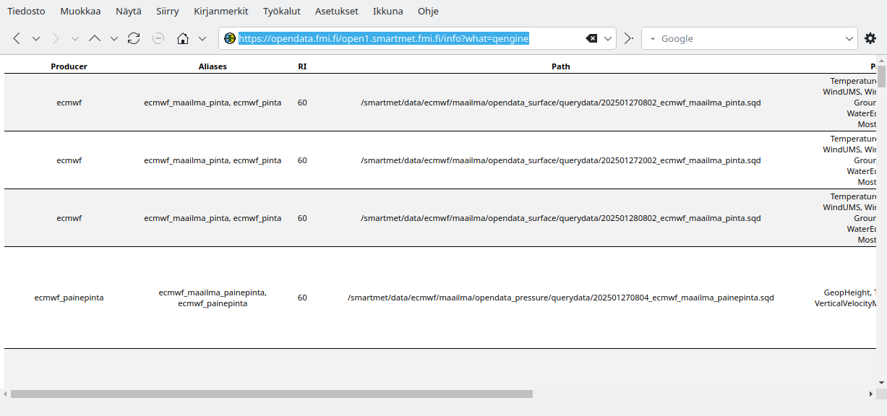

## GeoEngine reload

GeoEngine can reload the geonames database in a separate thread, and quickly swap all the information into use, replacing all the previously downloaded data. The swap will be delayed by active read requests until the write operation gains a lock on the necessary data structures.

Note that the reload request will  use one thread from the server until the swap has been completed. If you are running a debug server with only one thread, you will not be able to do any requests while the reload is in progress.

    http://data.fmi.fi/Server1/admin?what=reload

Possible responses from the server are:

    1. GeoEngine is not available
    2. GeoEngine reload refused, one is already in progress
    3. GeoEngine reloaded in N seconds

It is also possible than an error occurs during the reload, for example if the MySQL server has gone down. In that case the old data structures remain active and no data is lost.

## Service statistics

The server keeps statistics on server requests which can be queried with

    http://data.fmi.fi/Server1/admin?what=servicestats

* The querystring option `plugin` can be used to limit the response to a single plugin.
* The querystring option `format` can be used to change the output format from the default `json`.

Below is a sample response as visualized by the Metadata Catalog:

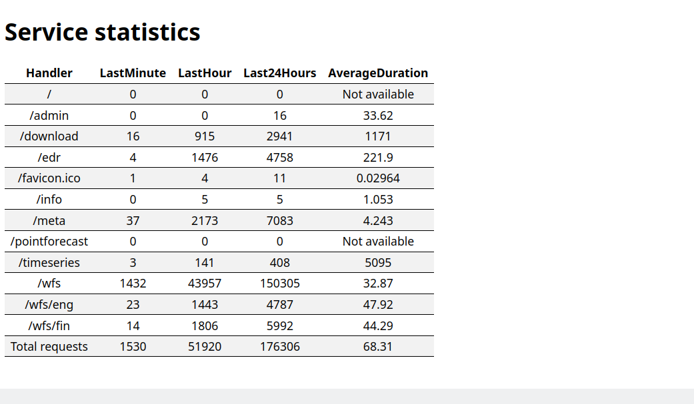

## Cache statistics

Each engine and plugin used by the server may keep internal caches whose sizes may require tuning for best performance. The statistics can be queried with

    http://data.fmi.fi/Server1/admin?what=cachestats

* The querystring option `format` can be used to change the output format from the default `html`
* The querystring option `timeformat` can be used to change the time formatting from the  default `sql`

Below is a sample response as visualized by the Metadata Catalog:

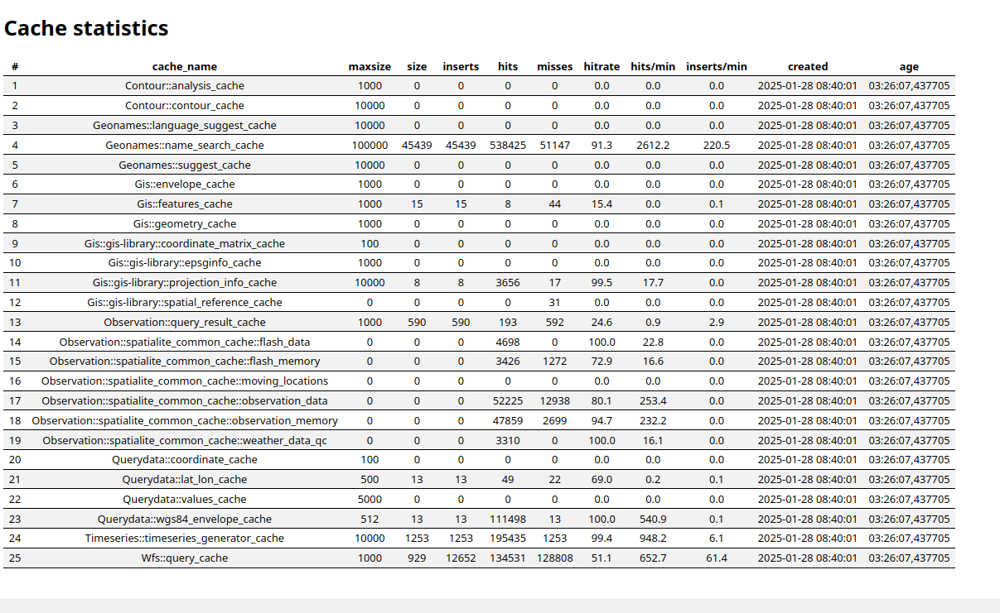

## Active requests
   
The server keeps track of active requests which have not been completed yet. This is occasionally useful for tracking down large requests which are hogging server resources. The active requests can be queried with

    http://data.fmi.fi/Server1/admin?what=activerequests

* The querystring option `format` can be used to change the output format from the default `json`

Below is a sample response as visualized by the Metadata Catalog:

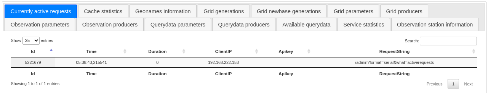

## Querydata producers

The querydata producers configured to the server can be listed with

    http://data.fmi.fi/Server1/admin?what=producers

* The querystring option `format` can be used to change the output format from the default `debug`
* The querystring option `producer` can be used to limit the output to a single producer name
* The querystring option `timeformat` can be used to change the time formatting from the default `sql`

Below is a sample response as visualized by the Metadata Catalog. The screen capture does not show all the columns, which show all the configuration parameters for the listed producer.

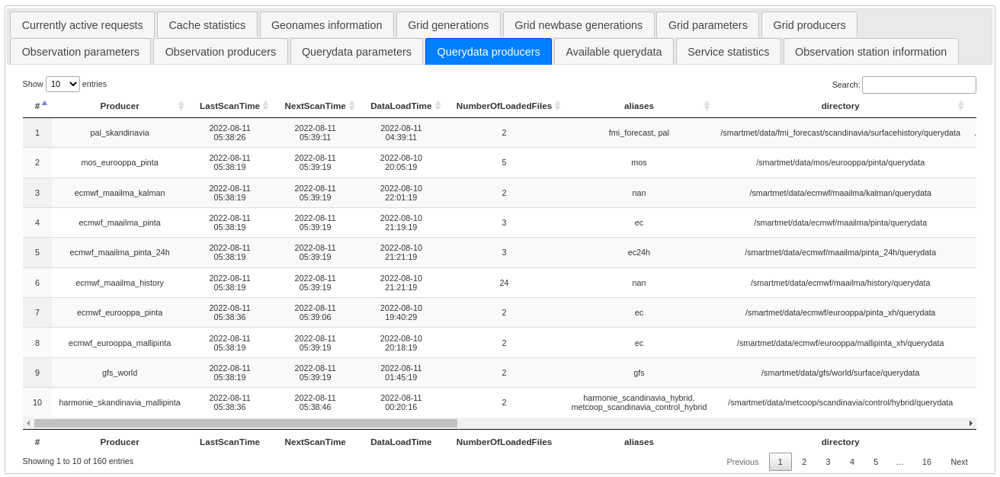

## GRID producers

The available grid data producers can be listed with

    http://data.fmi.fi/Server1/admin?what=gridproducers

* The querystring option `format` can be used to change the output format from the default `debug`
* The querystring option `producer` can be used to limit the output to a single producer name
* The querystring option `timeformat` can be used to change the time formatting from the default `sql`

Below is a sample response as visualized by the Metadata Catalog:

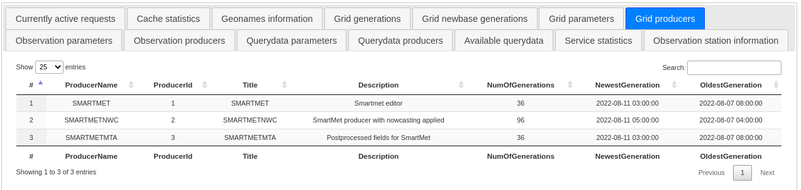

## GRID generations

Different model runs which may consist of multiple grid data files are called generations. The data for a particular generation can usually be requested by specifying the `origintime` querystring option. The information can be requested with

    http://data.fmi.fi/Server1/admin?what=gridgenerations

* The querystring option `format` can be used to change the output format from the default `debug`
* The querystring option `producer` can be used to limit the output to a single producer name
* The querystring option `timeformat` can be used to change the time formatting from the default `sql`

Below is a sample response as visualized by the Metadata Catalog:

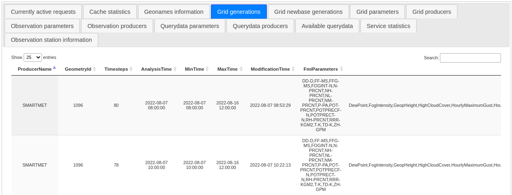

## GRID querydata generations

In GRID mode the server can also bypass the QueryData engine, as the Grid Engine can also process querydata files. The information on the available querydata generations can be requested with

    http://data.fmi.fi/Server1/admin?what=gridgenerationsqd

`sqd` is the common suffix used for binary querydata files at `FMI`.

* The querystring option `format` can be used to change the output format from the default `debug`
* The querystring option `producer` can be used to limit the output to a single producer name
* The querystring option `timeformat` can be used to change the time formatting from the default `sql`

Below is a sample response as visualized by the Metadata Catalog:

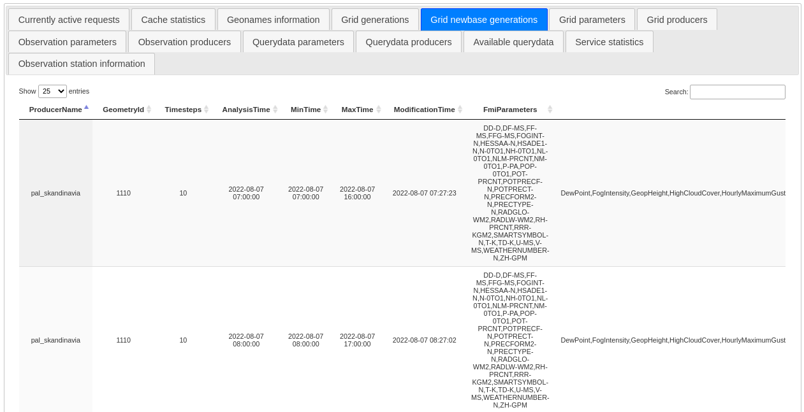

## Observation producers

The available observation producers can be queried with

    http://data.fmi.fi/Server1/admin?what=obsproducers

* The querystring option `format` can be used to change the output format from the default `debug`
* The querystring option `producer` can be used to limit the output to a single producer name
* The querystring option `timeformat` can be used to change the time formatting from the default `sql`

Below is a sample response as visualized by the Metadata Catalog:

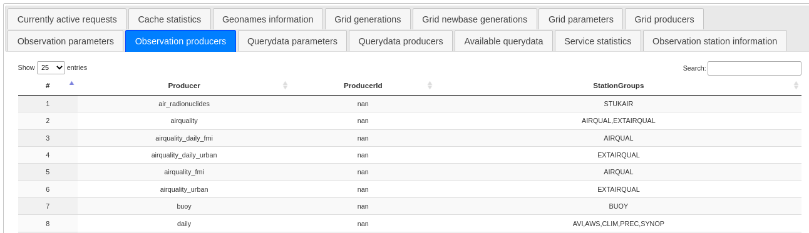

## Parameters

The known querydata parameters can be queried with

    http://data.fmi.fi/Server1/admin?what=parameters

* The querystring option `format` can be used to change the output format from the default `debug`
* The querystring option `producer` can be used to limit the output to a single producer name
* The querystring option `timeformat` can be used to change the time formatting from the default `sql`

Below is a sample response as visualized by the Metadata Catalog. The interface has been used to search for producers which provice the `IceConcentration` parameter.

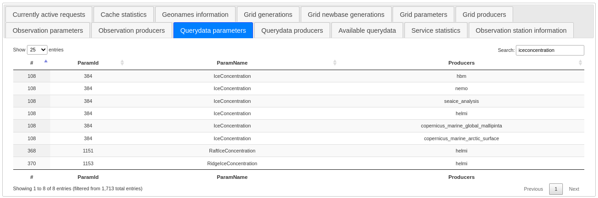

## GRID parameters

The known Grid parameters can be queried with

    http://data.fmi.fi/Server1/admin?what=gridparameters

* The querystring option `format` can be used to change the output format from the default `debug`
* The querystring option `producer` can be used to limit the output to a single producer name
* The querystring option `timeformat` can be used to change the time formatting from the default `sql`

Below is a sample response as visualized by the Metadata Catalog. The interface has been used to search for producers which provice the `Temperature` parameter.

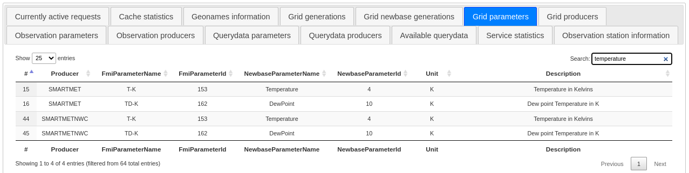

## Observation parameters

The known observation parameters can be queried with

    http://data.fmi.fi/Server1/admin?what=obsparameters
    
* The querystring option `format` can be used to change the output format from the default `debug`
* The querystring option `producer` can be used to limit the output to a single producer name
* The querystring option `timeformat` can be used to change the time formatting from the default `sql`

Below is a sample response as visualized by the Metadata Catalog. The interface has been used to search for producers which provice the `Temperature` parameter.

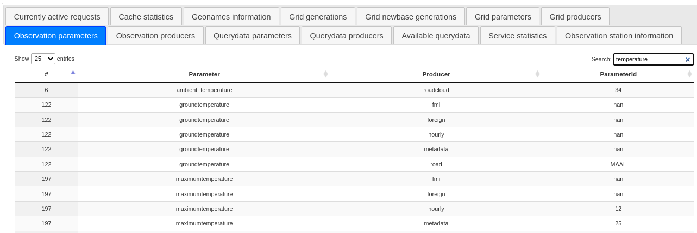

## Stations

The known stations can be queried with

    http://data.fmi.fi/Server1/admin?what=stations
    
* The querystring option `format` can be used to change the output format from the default `debug`
* The querystring option `timeformat` can be used to change the time formatting from the default `sql`
* The querystring option `fmisid` can be used to limit the search based on the FMI station number
* The querystring option `lpnn` can be used to limit the search based on the legacy FMI LPNN station number
* The querystring option `wmo` can be used to limit the search based on the station WMO number
* The querystring option `rwsid` can be used to limit the search based on the Finnish road station number
* The querystring option `type` can be used to limit the search based on the type of the station
* The querystring option `name` can be used to limit the search based on the name of the station
* The querystring option `country` can be used to limit the search based on the ISO code of the country
* The querystring option `region` can be used to limit the search based on the region the station is in
* The querystring options `starttime` and `endtime` can be used to limit the search based on the time the station has been active
* The querystring option `bbox` of form `lon1,lat1,lon2,lat2` can be used to limit the search area

Below is a sample response as visualized by the Metadata Catalog. The interface has been used to search for highest stations in Espoo.

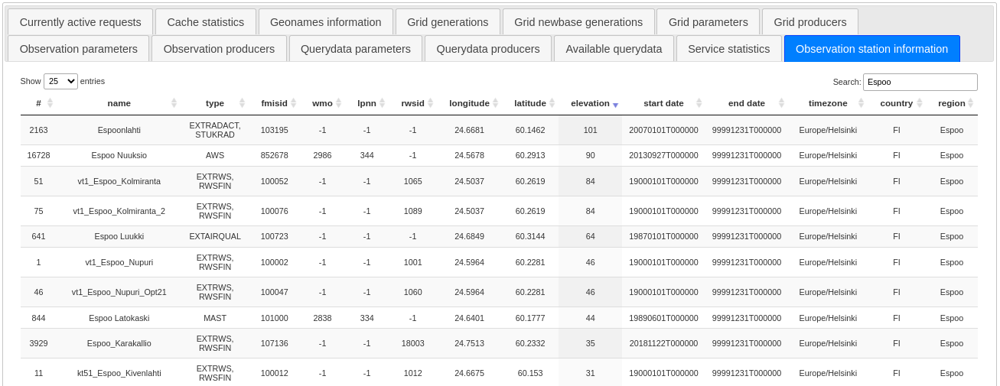

## Logging

Logging requests to memory can be enabled and disabled using queries

    http://data.fmi.fi/Server1/admin?what=setlogging?status=enable
    http://data.fmi.fi/Server1/admin?what=setlogging?status=disable

The current status can be queried with

    http://data.fmi.fi/Server1/admin?what=getlogging

* The querystring option `format` can be used to change the output format from the default `json`

The response value is either `Enabled` or `Disabled`.

## Last requests

The requests logged to memory can be queried with

    http://data.fmi.fi/Server1/admin?what=lastrequests

* The querystring option `format` can be used to change the output format from the default `json`
* The querystring option `minutes` can be used to modify how many minutes of last request are returned, the default value is one.
* The querystring option `plugin` can be used to limit the request to a specific plugin

## Pausing

A backend can be requested to pause serving the frontends using

    http://data.fmi.fi/Server1/admin?what=pause

By default the server will pause until the request

    http://data.fmi.fi/Server1/admin?what=continue

is used.

* If the querystring option `time` is give, the server will pause until the specified time
* If the querystring option `duration` is given, the server will pause for the given duration and then continue automatically.

## Reloading station information

The request

    http://data.fmi.fi/Server1/admin?what=reloadstations

can be used to request the Observation Engine to reload all station info cached into memory from the backend observation metadata database.

## Listing

The requests suitable for the Metadata Catalog can be requested with

    http://data.fmi.fi/Server1/admin?what=list

* The querystring option `format` can be used to change the output format from the default `debug`

Below is a sample response as visualized by a browser using the default `debug` format:

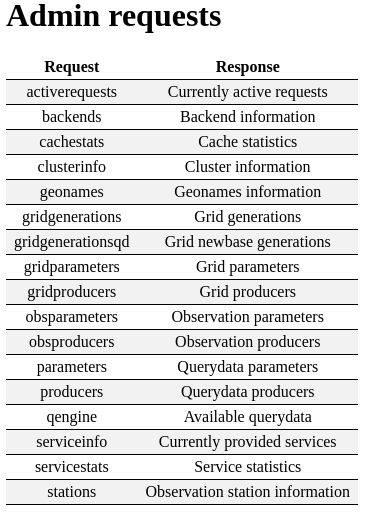
